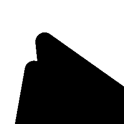

# Shape-Completion-with-Partial-Observations
This repository contains a pytorch implementation of our sub-project **shape completion with partial observations** of [AI-enabled Exploration and Surveillance](https://tsairesearch.github.io/projects/autonomous). In the exploration and surveillance problems, an unknown environment of 2D/3D that consits of the free space and finite obstacles is given, and the main objective is to design efficint algorithms to find a minimal sequence of locations for sensors to achieve full visibility of such environment. In the process of placing sensors, we obtain sequence of images that contains partially observed obstacles. One interesting problem is, if we can develop mahcine learning models to recover the underlying environment from partially observed sets. If this can be done, we can include these inferences into decision process for placing sensors and design more efficient algorithms from this. Our goal in this project is to train a deep learning model using the [pix2pix GAN](https://ieeexplore.ieee.org/document/8100115) framework, to inference the underlying environment from images of partially observed obstacles.
<p align="center">
    
</p>
<p align="center">
    
</p>


## Usage


## Train model:
```bash
python pix2pix.py --n_epochs 15 --save_name "city_v0" --dataset_folder "data/urban_envs/exploration/train" --batch_size 1 --pixel_loss "L1" --lambda_pixel 100.0 --cuda 1 --in_img_format "level_set_fun" --in_frontier 1 --include_stoppage 1 --out_activation "tanh" --img_height 256 --img_width 256  --sample_interval 1000
```
optional arguments:
*  `-h, --help`           show help message and exit
*  `--cuda`  set it to 1 for running on GPU, 0 for CPU (default=0)
*  `--n_epochs` number of epochs of training (default=200)
*  `--save_name` name of saved model (default="facades")
*  `--dataset_folder` path of the data set folder
*  `--batch_size` size of the batches (default=1)
*  `--include_stoppage` Include images that greedy algorithm stopped (default=1)
*  `--n_cpu` number of cpu threads to use during batch generation (default=8)
*  `--img_height` size of image height (default=256)
*  `--img_width` size of image width (default=256)
*  `--in_img_format` input image format:binary or level_set_fun (default="binary")
*  `--in_frontier` input shadow boundries if 1 (default=0)
*  `--out_activation` activation for generator's outputs (default="sigmoid")
*  `--pixel_loss` pixel loss: L1 or BCE (default="L1")
*  `--GAN_loss` GAN loss: MSE or BCE (default="BCE")
*  `--lambda_pixel` weight for pixel loss (default="100.0")
*  `--sample_interval` a positive integer N to output several images of results every N batches (default=500)
*  `--max_files` number of max files (default=100000)
*  `--lr` adam: learning rate (default=0.0002)
*  `--b1` adam: decay of first order momentum of gradient (default=0.5)
*  `--b2` adam: decay of first order momentum of gradient (default=0.999)
*  `--decay_epoch` epoch from which to start lr decay (default=100)
*  `--epoch` epoch to start training from (default=0)
*  `--checkpoint_interval` interval between model checkpoints (default=-1)

## Inference/Shape completion examples:
There are two saved models trained with circles and urban environemnts separately. To test the trained models, please download and put them (from [circles](https://drive.google.com/file/d/1OC5KkQiXxeqvclOXWxYk3sV57vhF3bXJ/view?usp=sharing) and [urban](https://drive.google.com/file/d/1f6v971Ez3d7hS2GUdyCUw0eGoKzYpWC4/view?usp=sharing)) separately in `/saved_models/circles` and `/saved_models/city_v0`. Several images in both cases provided in `/data/circles/test/` and `/data/urban_envs/test/` for testing.

Test for the circles environments:
```bash
python pix2pix_test.py --cuda 1 --input_dir "data/circles/test" --model_path "saved_models/circles/generator_49.pth"
```

Test for the urban environments:
```bash
python pix2pix_test.py --cuda 1 --input_dir "data/urban_envs/test" --model_path "saved_models/city_v0/generator_14.pth"
```
optional arguments:
*  `-h, --help`            show help message and exit
*  `--cuda` set it to 1 for running on GPU, 0 for CPU (default=0)
*  `--input_dir` path to the testing data (default=`None`)
*  `--model_path` path to the trained model (default=`None`)
*  `--batch_size` size of the batches (default=4)
*  `--n_cpu` number of cpu threads to use during batch generation (default=8)

## Results for circles environments:
<table align='center'>
<tr align='center'>
<td> Partial Obs
<td> 
<td> 
<td> 
<td> 
<td> 
<td> 
</tr>


<tr>
<td> True
<td> 
<td> 
<td> 
<td> 
<td> 
<td> 
</tr>

<tr>
<td> Prediction
<td> 
<td> 
<td> 
<td> 
<td> 
<td> 
</tr>

</table>


## Results for urban environments:
<table align='center'>
<tr align='center'>
<td> Partial Obs
<td> 
<td> 
<td> 
<td> 
<td> 
<td> 
</tr>


<tr>
<td> True
<td> 
<td> 
<td> 
<td> 
<td> 
<td> 
</tr>

<tr>
<td> Prediction
<td> 
<td> 
<td> 
<td> 
<td> 
<td> 
</tr>

</table>


